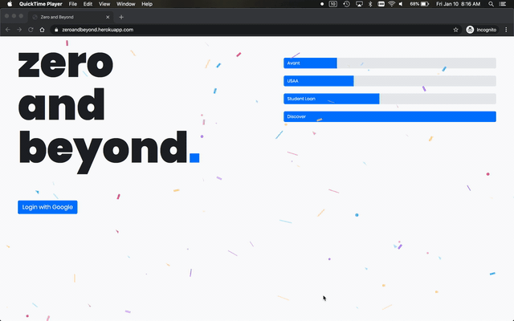
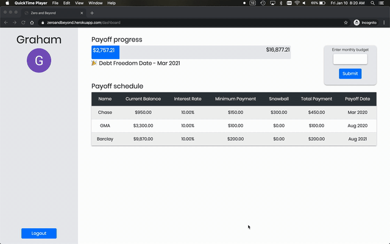

# [Zero and Beyond](https://zeroandbeyond.herokuapp.com/)

### Background

Zero and Beyond is an application that aims to ease the burden of paying off debts. Thousands of people use [You Need a Budget](https://www.youneedabudget.com/) (or YNAB) for their budgeting needs. However, YNAB currently lacks some functionality when it comes to debts. Users are unable to utilize different debt payoff strategies, see their debt payoff date, or enter custom amounts to see how changes will affect their debt payoff date. This is where ZAB comes in! With YNAB integration, users can import their debts from their existing budget, enter their minimum payments and interest rates, and immediately see a timeline for paying off their debts.

### Technology Specific Background

ZAB is built on Ruby on Rails and utilizes a microservice built on Sinatra (which can be found [here](https://github.com/zacisaacson/zab-service)). The primary application utilizes Google OAuth for authenticating users and stores their data in a PostgreSQL database. The ZAB microservice is responsible for pulling user account data from the YNAB API. On the frontend, ZAB utilizes CSS and Bootstrap as well as JavaScript for more complex functionality (such as updating debts based on user input without reloading the page).

### Planned Updates

- Add more debt payoff strategies (snowball is the current default method)
- Add the ability for users to share their progress on social media
- Allow users to connect with other ZAB users
- Provide users with more detailed information about their accounts and debt payoff strategy.

### See it Live:

https://zeroandbeyond.herokuapp.com/

### Microservice

Associated backend repo can be found [here](https://github.com/dForDeveloper/paired-api)

### Primary Technologies Used:

- Ruby on Rails
- JavaScript
- PostgreSQL
- Redis
- Sidekiq
- Sendgrid
- Google OAuth
- RSpec (for testing)

### Preview:

#### Logging In and Importing Accounts:

#### Entering Monthly Debt Payment:

### Wireframes:

- [Figma](https://www.figma.com/file/zTsuC4msWc2RMAflMqoYBa/Dashboard)

### Original Assesment

[Terrificus Project Spec](https://backend.turing.io/module3/projects/terrificus) from Turing School of Software & Design where ZAB was originally conceived.

### Contributors

[Zac Isaacson](https://github.com/zacisaacson)
[Laura Schulz](https://github.com/lrs8810)
[Hillary Stewart](https://github.com/hillstew)  
[Graham Thompson](https://github.com/grwthomps)
